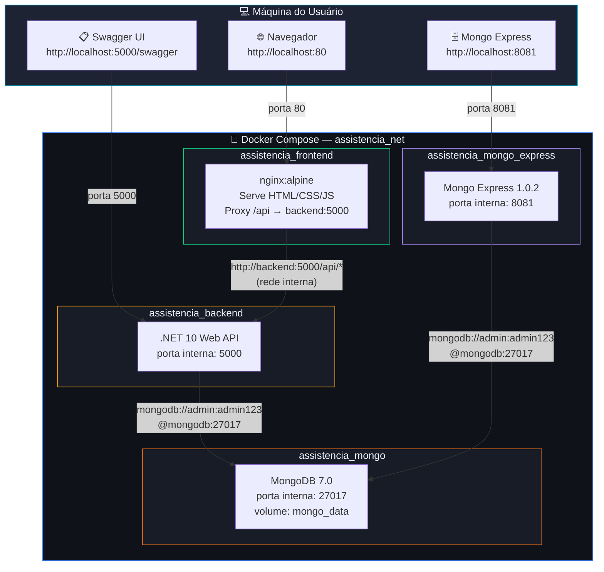
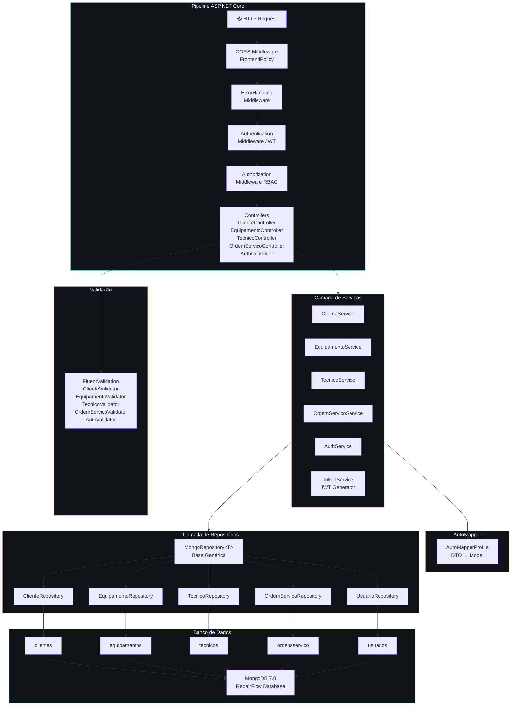
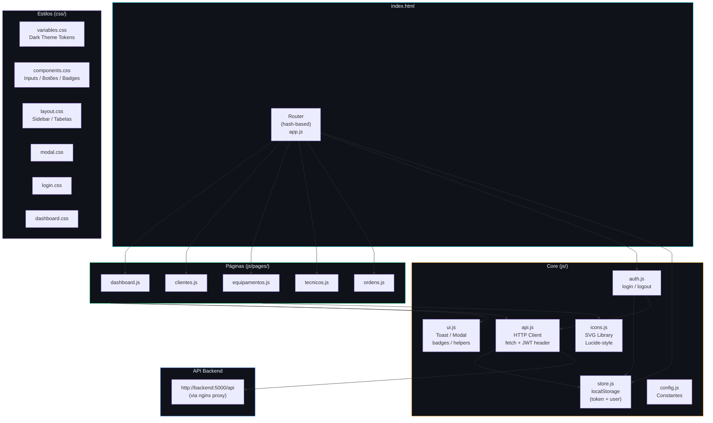
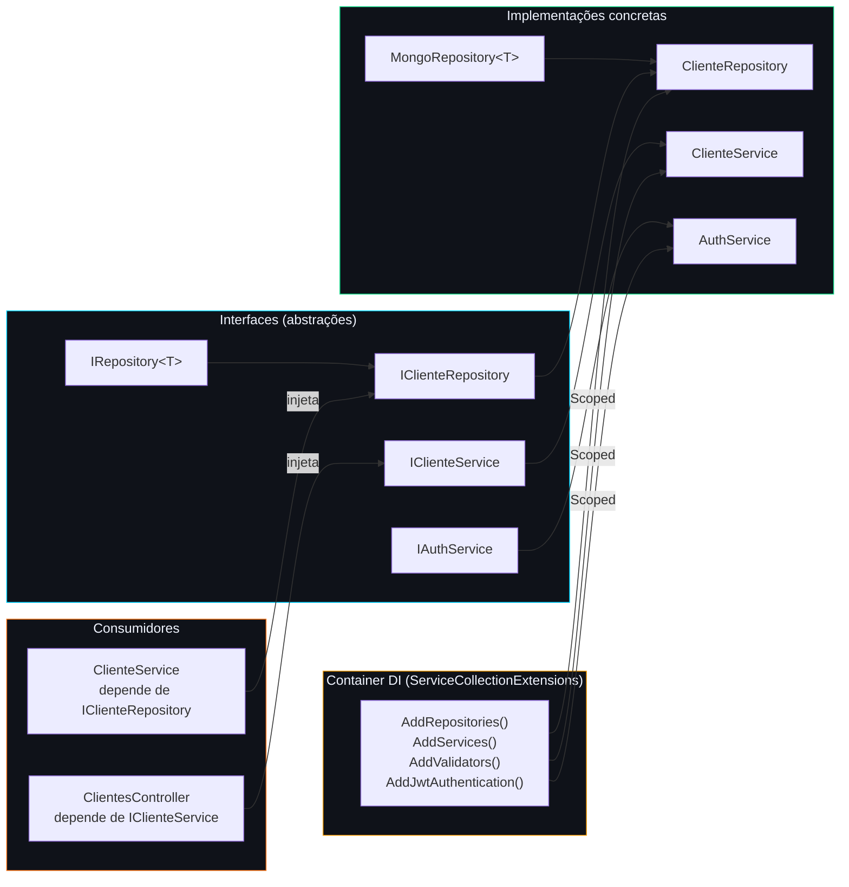

# 🏗 Arquitetura Geral — RepairFlow

Visão completa da arquitetura do sistema: containers, camadas internas da API, fluxo de dados e infraestrutura Docker.

---

## 1. Visão de Containers (Docker Compose)

---

## 2. Camadas Internas da API (.NET 10)

---

## 3. Arquitetura do Frontend

---

## 4. Padrão de Injeção de Dependências

