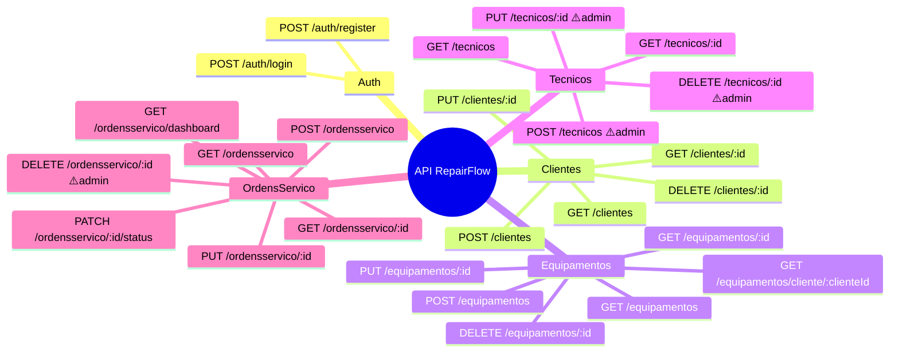
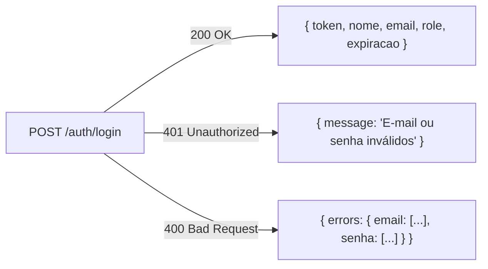
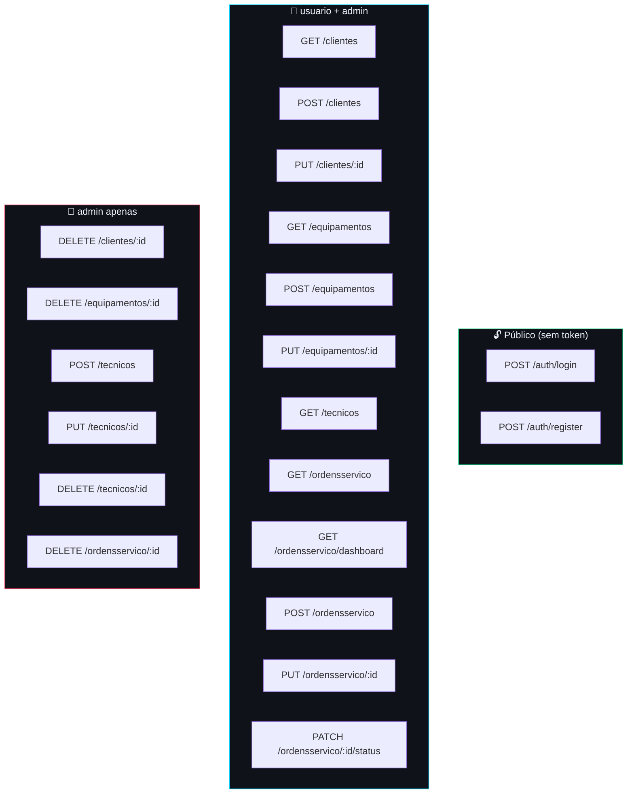

# 📡 Endpoints REST — RepairFlow API

Referência completa de todos os endpoints, com métodos HTTP, autenticação, roles, parâmetros, body e respostas.

**Base URL:** `http://localhost:5000/api`
**Autenticação:** `Authorization: Bearer {token}` (exceto rotas de Auth)
**Formato:** `application/json`

---

## Mapa de Rotas



---

## 🔐 Auth

### `POST /api/auth/login`

Autentica um usuário e retorna um token JWT.

**Auth:** ❌ Não requer token

**Request Body:**
```json
{
  "email": "admin@repairflow.com",
  "senha": "Admin123"
}
```

**Responses:**



| Código | Situação |
|---|---|
| `200` | Login bem-sucedido, retorna JWT |
| `400` | Campos inválidos (e-mail mal formatado, senha vazia) |
| `401` | Usuário não existe ou senha incorreta |

**Response 200:**
```json
{
  "token": "eyJhbGciOiJIUzI1NiIsInR5cCI6IkpXVCJ9...",
  "nome": "Admin RepairFlow",
  "email": "admin@repairflow.com",
  "role": "admin",
  "expiracao": "2026-05-29T17:00:00Z"
}
```

---

### `POST /api/auth/register`

Registra um novo usuário no sistema.

**Auth:** ❌ Não requer token

**Request Body:**
```json
{
  "nome": "Novo Usuário",
  "email": "usuario@repairflow.com",
  "senha": "Senha123",
  "role": "usuario"
}
```

**Validações:**
- `nome`: mínimo 3 caracteres
- `senha`: mínimo 6 chars, ao menos 1 maiúscula, ao menos 1 número
- `role`: somente `"admin"` ou `"usuario"`

| Código | Situação |
|---|---|
| `201` | Usuário criado, retorna JWT |
| `400` | Dados inválidos (senha fraca, e-mail mal formatado) |
| `409` | E-mail já cadastrado |

---

## 👥 Clientes

### `GET /api/clientes`

Lista todos os clientes cadastrados.

**Auth:** ✅ Bearer Token | **Role:** `usuario` ou `admin`

**Response 200:**
```json
[
  {
    "id": "6a163d7767240f5f1e6ec69d3",
    "nome": "João Silva",
    "cpf": "529.982.247-25",
    "email": "joao@email.com",
    "telefone": "(11) 99999-9999",
    "endereco": "Rua das Flores, 123",
    "dataCadastro": "2026-05-01T10:00:00Z"
  }
]
```

---

### `GET /api/clientes/{id}`

Busca um cliente pelo ID.

**Auth:** ✅ | **Role:** `usuario` ou `admin`

| Código | Situação |
|---|---|
| `200` | Cliente encontrado |
| `404` | ID não existe |

---

### `POST /api/clientes`

Cadastra um novo cliente.

**Auth:** ✅ | **Role:** `usuario` ou `admin`

**Request Body:**
```json
{
  "nome": "Maria Santos",
  "cpf": "987.654.321-09",
  "email": "maria@email.com",
  "telefone": "(11) 88888-8888",
  "endereco": "Av. Paulista, 1000"
}
```

| Código | Situação |
|---|---|
| `201` | Cliente criado |
| `400` | Dados inválidos |
| `409` | CPF ou e-mail já cadastrado |

---

### `PUT /api/clientes/{id}`

Atualiza dados de um cliente.

**Auth:** ✅ | **Role:** `usuario` ou `admin`

**Body:** mesmo schema do POST

| Código | Situação |
|---|---|
| `200` | Atualizado com sucesso |
| `404` | ID não existe |
| `409` | CPF ou e-mail em uso por outro cliente |

---

### `DELETE /api/clientes/{id}`

Remove um cliente.

**Auth:** ✅ | **Role:** 🔴 `admin` apenas

| Código | Situação |
|---|---|
| `204` | Removido com sucesso |
| `403` | Role insuficiente |
| `404` | ID não existe |

---

## 🖥 Equipamentos

### `GET /api/equipamentos`

Lista todos os equipamentos com nome do cliente vinculado.

**Auth:** ✅ | **Role:** `usuario` ou `admin`

**Response 200:**
```json
[
  {
    "id": "6b274e8868351g6g2f7fd7e4",
    "nome": "Samsung Galaxy S24",
    "marca": "Samsung",
    "modelo": "Galaxy S24 Ultra",
    "numeroSerie": "SN-XYZ-123456",
    "clienteId": "6a163d7767240f5f1e6ec69d3",
    "nomeCliente": "João Silva",
    "categoria": "Smartphone",
    "dataEntrada": "2026-05-15T14:30:00Z"
  }
]
```

---

### `GET /api/equipamentos/cliente/{clienteId}`

Lista equipamentos de um cliente específico.

**Auth:** ✅ | **Role:** `usuario` ou `admin`

---

### `POST /api/equipamentos`

Cadastra novo equipamento vinculado a um cliente.

**Auth:** ✅ | **Role:** `usuario` ou `admin`

**Request Body:**
```json
{
  "nome": "MacBook Pro",
  "marca": "Apple",
  "modelo": "MacBook Pro 14\" M3",
  "numeroSerie": "C02X1234JGH5",
  "clienteId": "6a163d7767240f5f1e6ec69d3",
  "categoria": "Notebook"
}
```

**Categorias válidas:** `Computador` `Notebook` `Smartphone` `Tablet` `Impressora` `TV` `Console` `Outro`

| Código | Situação |
|---|---|
| `201` | Equipamento criado |
| `404` | ClienteId não existe |
| `409` | Número de série já cadastrado |

---

### `DELETE /api/equipamentos/{id}`

**Auth:** ✅ | **Role:** 🔴 `admin` apenas

---

## 🔧 Técnicos

### `POST /api/tecnicos`

**Auth:** ✅ | **Role:** 🔴 `admin` apenas

**Request Body:**
```json
{
  "nome": "Carlos Mendes",
  "especialidade": "Smartphones",
  "telefone": "(11) 98888-7777",
  "email": "carlos@repairflow.com"
}
```

**Especialidades válidas:** `Eletrônica Geral` `Smartphones` `Computadores` `Notebooks` `Impressoras` `TVs e Monitores` `Consoles` `Eletrodomésticos` `Outro`

| Código | Situação |
|---|---|
| `201` | Técnico criado |
| `403` | Role insuficiente (não é admin) |
| `409` | E-mail já cadastrado |

---

### `PUT /api/tecnicos/{id}` e `DELETE /api/tecnicos/{id}`

**Auth:** ✅ | **Role:** 🔴 `admin` apenas

---

## 📋 Ordens de Serviço

### `GET /api/ordensservico`

Lista ordens com filtro opcional por status.

**Auth:** ✅ | **Role:** `usuario` ou `admin`

**Query Params:**

| Parâmetro | Tipo | Obrigatório | Valores |
|---|---|---|---|
| `status` | string | ❌ | `Aberta` `EmAndamento` `AguardandoPeca` `Finalizada` |

**Exemplos:**
```
GET /api/ordensservico                          → todas
GET /api/ordensservico?status=Aberta           → só abertas
GET /api/ordensservico?status=EmAndamento      → em andamento
```

**Response 200:**
```json
[
  {
    "id": "8d496ga8a8573i8i4h9hf9g6",
    "equipamentoId": "6b274e8868351g6g2f7fd7e4",
    "nomeEquipamento": "Samsung Galaxy S24",
    "clienteId": "6a163d7767240f5f1e6ec69d3",
    "nomeCliente": "João Silva",
    "tecnicoId": "7c385f9979462h7h3g8ge8f5",
    "nomeTecnico": "Carlos Mendes",
    "problemaRelatado": "Tela não acende após queda.",
    "diagnostico": "Conector do display danificado.",
    "solucao": null,
    "valor": 350.00,
    "status": "EmAndamento",
    "prioridade": "Alta",
    "dataAbertura": "2026-05-20T09:00:00Z",
    "dataConclusao": null
  }
]
```

---

### `GET /api/ordensservico/dashboard`

Retorna estatísticas para o painel principal.

**Auth:** ✅ | **Role:** `usuario` ou `admin`

> ⚠️ **Importante:** esta rota está declarada **antes** de `GET /ordensservico/{id}` no controller para evitar que o roteador interprete `"dashboard"` como um ID.

**Response 200:**
```json
{
  "totalClientes": 12,
  "totalEquipamentos": 28,
  "totalTecnicos": 5,
  "totalOrdens": 47,
  "contagemPorStatus": {
    "Aberta": 8,
    "EmAndamento": 12,
    "AguardandoPeca": 4,
    "Finalizada": 23
  },
  "ordensAlta": 3
}
```

---

### `POST /api/ordensservico`

Abre uma nova ordem de serviço. Status inicial é sempre `Aberta`.

**Auth:** ✅ | **Role:** `usuario` ou `admin`

**Request Body:**
```json
{
  "equipamentoId": "6b274e8868351g6g2f7fd7e4",
  "tecnicoId": "7c385f9979462h7h3g8ge8f5",
  "problemaRelatado": "Tela não acende após queda no chão.",
  "valor": 0.00,
  "prioridade": "Alta",
  "diagnostico": null
}
```

**Validações:**
- `problemaRelatado`: mínimo 10 caracteres
- `valor`: mínimo 0
- `prioridade`: `Baixa` | `Media` | `Alta`

| Código | Situação |
|---|---|
| `201` | Ordem criada com status `Aberta` |
| `404` | EquipamentoId ou TecnicoId não existe |
| `400` | Dados inválidos |

---

### `PATCH /api/ordensservico/{id}/status`

Atualiza o status e opcionalmente diagnóstico, solução e valor.

**Auth:** ✅ | **Role:** `usuario` ou `admin`

**Request Body:**
```json
{
  "status": "Finalizada",
  "diagnostico": "Conector do display danificado e tela com defeito.",
  "solucao": "Substituição completa do display e conector.",
  "valor": 350.00
}
```

> Quando `status = "Finalizada"`, o campo `dataConclusao` é preenchido automaticamente com `DateTime.UtcNow`.

| Código | Situação |
|---|---|
| `200` | Status atualizado, retorna ordem completa |
| `404` | ID da ordem não existe |
| `400` | Status inválido |

---

## 📊 Tabela Resumo — Roles e Permissões



---

## 🚨 Códigos de Resposta Padrão

| Código | Nome | Quando ocorre |
|---|---|---|
| `200` | OK | Requisição bem-sucedida (GET, PUT, PATCH) |
| `201` | Created | Recurso criado (POST) |
| `204` | No Content | Removido com sucesso (DELETE) |
| `400` | Bad Request | Dados inválidos (FluentValidation) |
| `401` | Unauthorized | Token ausente, inválido ou expirado |
| `403` | Forbidden | Token válido, mas role insuficiente |
| `404` | Not Found | ID não existe (KeyNotFoundException) |
| `409` | Conflict | Duplicidade (CPF, e-mail, número de série) |
| `500` | Internal Server Error | Erro não tratado no servidor |

**Formato de erro padrão (ErrorHandlingMiddleware):**
```json
{
  "statusCode": 404,
  "message": "Cliente com ID 'abc123' não encontrado.",
  "timestamp": "2026-05-29T12:00:00Z"
}
```
