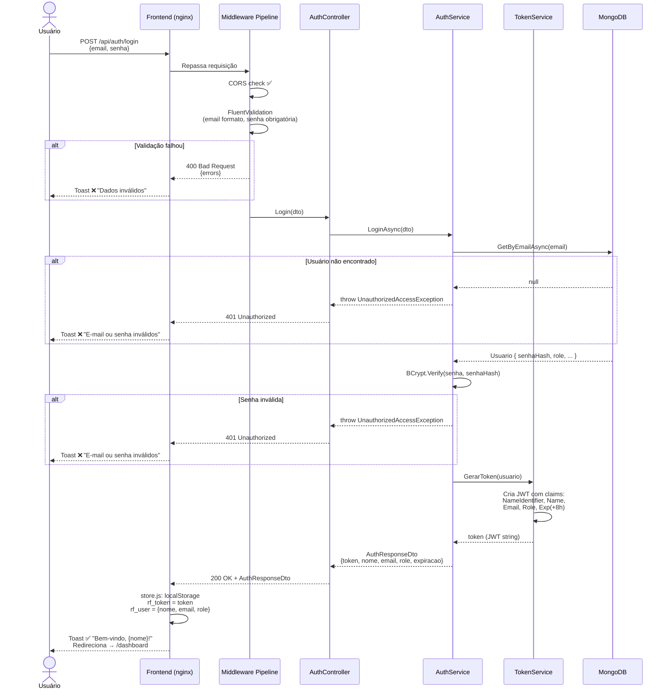
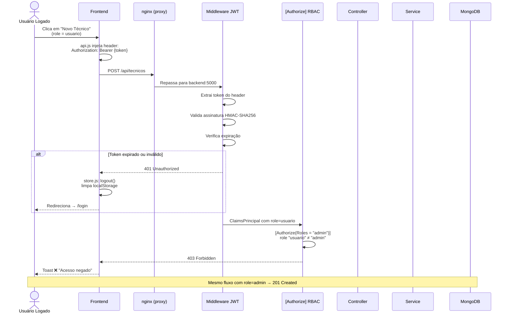
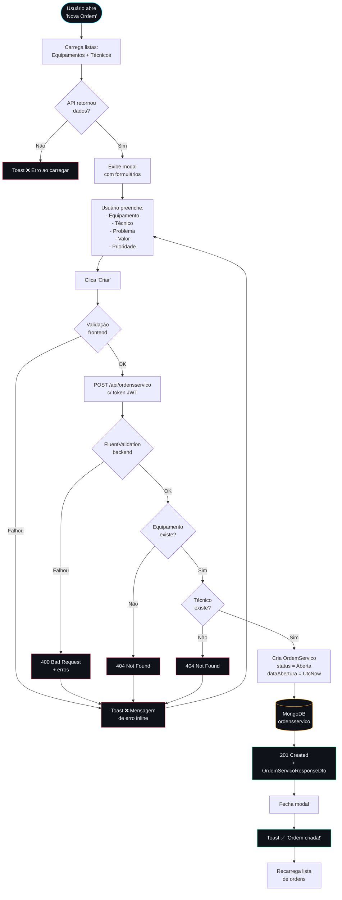
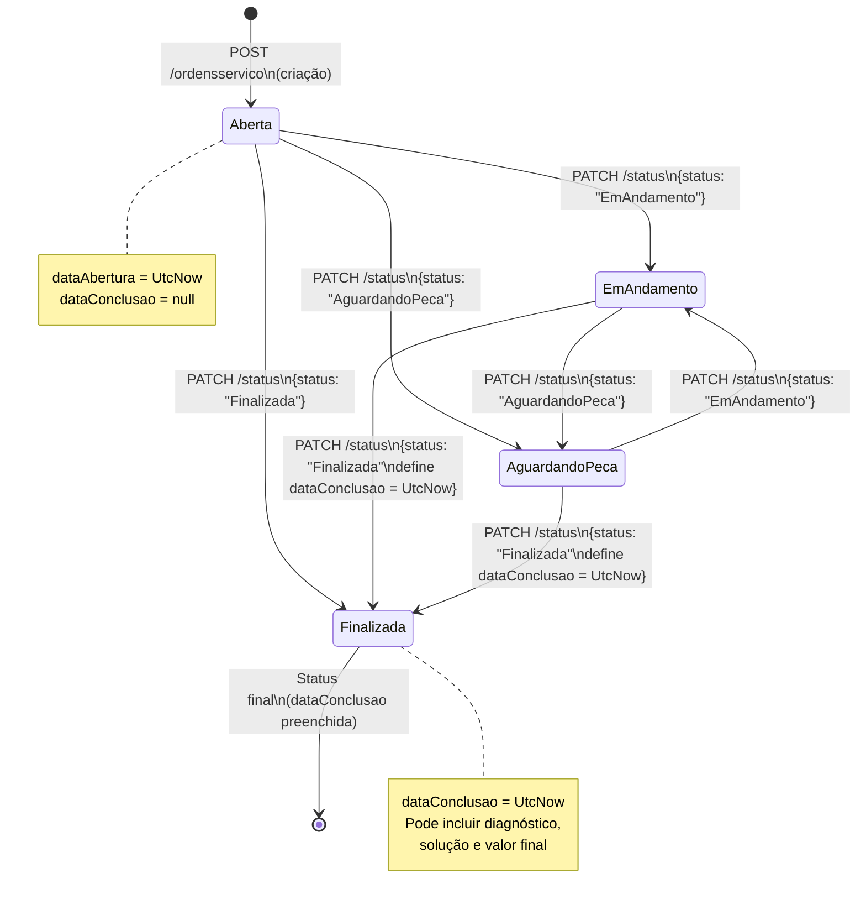
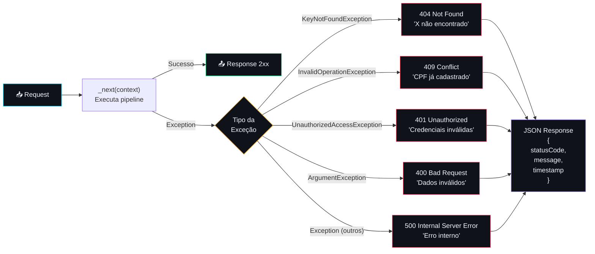
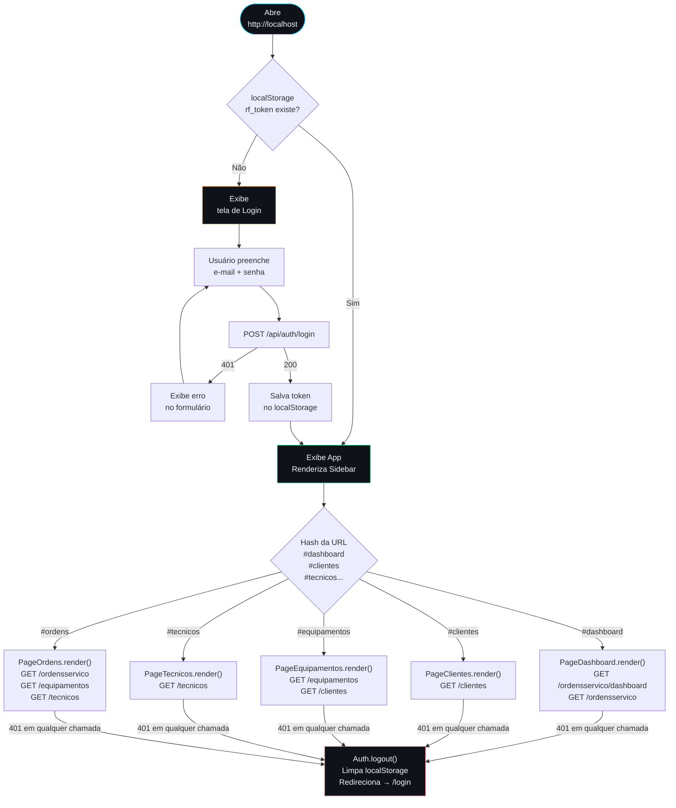

# 🔄 Fluxos do Sistema — RepairFlow

Diagramas de sequência e fluxo para os principais processos do sistema.

---

## 1. Fluxo de Autenticação JWT

---

## 2. Fluxo de Requisição Autenticada (RBAC)

---

## 3. Fluxo Completo — Criação de Ordem de Serviço

---

## 4. Ciclo de Vida de uma Ordem de Serviço

---

## 5. Fluxo do Tratamento de Erros (Middleware)

---

## 6. Fluxo de Navegação do Frontend (SPA)

