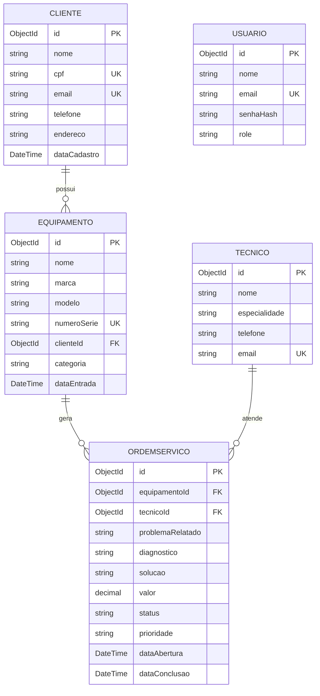
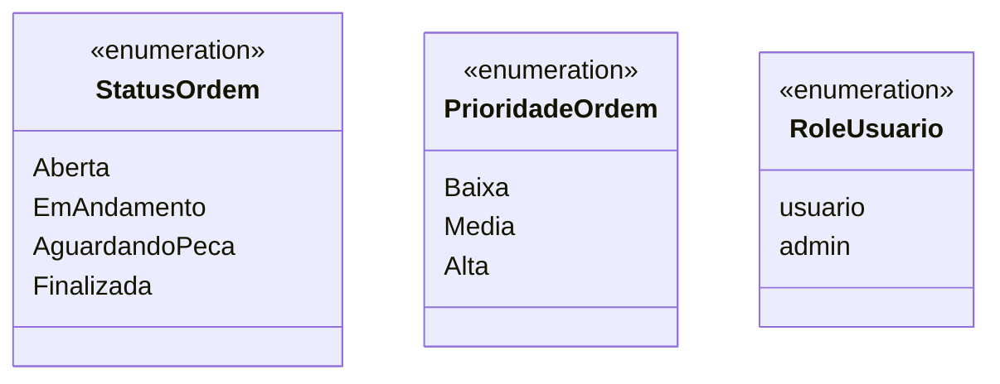
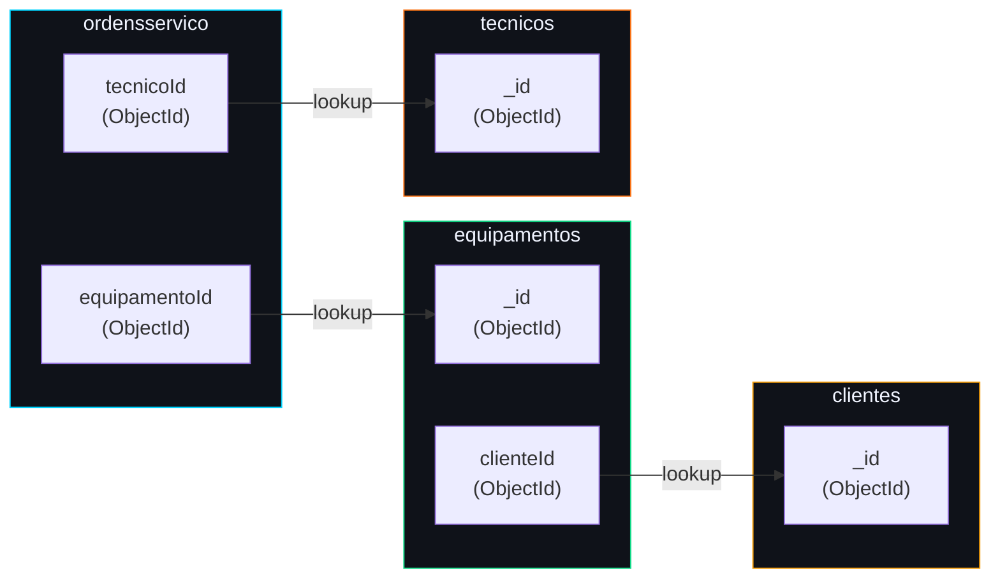

# 🗄 Modelos de Dados — RepairFlow

Estrutura das coleções MongoDB, campos, tipos e relacionamentos entre entidades.

Cole o código Mermaid abaixo em https://mermaid.live para visualizar.

---

## 1. Diagrama Entidade-Relacionamento



---

## 2. Coleções MongoDB — Detalhamento

### 📁 `clientes`

| Campo | Tipo BSON | Obrigatório | Único | Descrição |
|---|---|---|---|---|
| `_id` | ObjectId | ✅ | ✅ | Identificador gerado automaticamente |
| `nome` | string | ✅ | ❌ | Nome completo do cliente |
| `cpf` | string | ✅ | ✅ | CPF no formato `000.000.000-00` |
| `email` | string | ✅ | ✅ | E-mail válido |
| `telefone` | string | ✅ | ❌ | Formato `(11) 99999-9999` |
| `endereco` | string | ✅ | ❌ | Endereço completo |
| `dataCadastro` | Date | ✅ | ❌ | Gerado automaticamente em UTC |

**Exemplo de documento:**
```json
{
  "_id": { "$oid": "6a163d7767240f5f1e6ec69d3" },
  "nome": "João Silva",
  "cpf": "529.982.247-25",
  "email": "joao@email.com",
  "telefone": "(11) 99999-9999",
  "endereco": "Rua das Flores, 123 - São Paulo/SP",
  "dataCadastro": { "$date": "2026-05-01T10:00:00Z" }
}
```

---

### 📁 `equipamentos`

| Campo | Tipo BSON | Obrigatório | Único | Descrição |
|---|---|---|---|---|
| `_id` | ObjectId | ✅ | ✅ | Identificador gerado automaticamente |
| `nome` | string | ✅ | ❌ | Nome do equipamento |
| `marca` | string | ✅ | ❌ | Fabricante |
| `modelo` | string | ✅ | ❌ | Modelo específico |
| `numeroSerie` | string | ✅ | ✅ | Número de série único |
| `clienteId` | ObjectId | ✅ | ❌ | Referência ao cliente dono |
| `categoria` | string | ✅ | ❌ | Computador / Notebook / Smartphone / Tablet / Impressora / TV / Console / Outro |
| `dataEntrada` | Date | ✅ | ❌ | Gerado automaticamente em UTC |

**Exemplo de documento:**
```json
{
  "_id": { "$oid": "6b274e8868351g6g2f7fd7e4" },
  "nome": "Samsung Galaxy S24",
  "marca": "Samsung",
  "modelo": "Galaxy S24 Ultra",
  "numeroSerie": "SN-XYZ-123456",
  "clienteId": { "$oid": "6a163d7767240f5f1e6ec69d3" },
  "categoria": "Smartphone",
  "dataEntrada": { "$date": "2026-05-15T14:30:00Z" }
}
```

---

### 📁 `tecnicos`

| Campo | Tipo BSON | Obrigatório | Único | Descrição |
|---|---|---|---|---|
| `_id` | ObjectId | ✅ | ✅ | Identificador gerado automaticamente |
| `nome` | string | ✅ | ❌ | Nome completo do técnico |
| `especialidade` | string | ✅ | ❌ | Eletrônica Geral / Smartphones / Computadores / Notebooks / Impressoras / TVs e Monitores / Consoles / Eletrodomésticos / Outro |
| `telefone` | string | ✅ | ❌ | Formato `(11) 99999-9999` |
| `email` | string | ✅ | ✅ | E-mail único do técnico |

**Exemplo de documento:**
```json
{
  "_id": { "$oid": "7c385f9979462h7h3g8ge8f5" },
  "nome": "Carlos Mendes",
  "especialidade": "Smartphones",
  "telefone": "(11) 98888-7777",
  "email": "carlos.mendes@repairflow.com"
}
```

---

### 📁 `ordensservico`

| Campo | Tipo BSON | Obrigatório | Único | Descrição |
|---|---|---|---|---|
| `_id` | ObjectId | ✅ | ✅ | Identificador gerado automaticamente |
| `equipamentoId` | ObjectId | ✅ | ❌ | Referência ao equipamento |
| `tecnicoId` | ObjectId | ✅ | ❌ | Referência ao técnico responsável |
| `problemaRelatado` | string | ✅ | ❌ | Descrição do problema (mín. 10 chars) |
| `diagnostico` | string | ❌ | ❌ | Diagnóstico técnico após análise |
| `solucao` | string | ❌ | ❌ | Solução aplicada ao final |
| `valor` | Decimal128 | ✅ | ❌ | Valor do serviço (≥ 0) |
| `status` | string | ✅ | ❌ | `Aberta` / `EmAndamento` / `AguardandoPeca` / `Finalizada` |
| `prioridade` | string | ✅ | ❌ | `Baixa` / `Media` / `Alta` |
| `dataAbertura` | Date | ✅ | ❌ | Gerado automaticamente em UTC |
| `dataConclusao` | Date | ❌ | ❌ | Preenchido quando status = Finalizada |

**Exemplo de documento:**
```json
{
  "_id": { "$oid": "8d496ga8a8573i8i4h9hf9g6" },
  "equipamentoId": { "$oid": "6b274e8868351g6g2f7fd7e4" },
  "tecnicoId":     { "$oid": "7c385f9979462h7h3g8ge8f5" },
  "problemaRelatado": "Tela não acende após queda. Apresenta linha horizontal no display.",
  "diagnostico": "Conector do display danificado e tela com defeito.",
  "solucao": null,
  "valor": 350.00,
  "status": "EmAndamento",
  "prioridade": "Alta",
  "dataAbertura": { "$date": "2026-05-20T09:00:00Z" },
  "dataConclusao": null
}
```

---

### 📁 `usuarios`

| Campo | Tipo BSON | Obrigatório | Único | Descrição |
|---|---|---|---|---|
| `_id` | ObjectId | ✅ | ✅ | Identificador gerado automaticamente |
| `nome` | string | ✅ | ❌ | Nome do usuário |
| `email` | string | ✅ | ✅ | E-mail único para login |
| `senhaHash` | string | ✅ | ❌ | Senha criptografada com BCrypt (cost=11) |
| `role` | string | ✅ | ❌ | `admin` ou `usuario` (padrão: `usuario`) |

**Exemplo de documento:**
```json
{
  "_id": { "$oid": "9e5a7hb9b9684j9j5i0ig0h7" },
  "nome": "Admin RepairFlow",
  "email": "admin@repairflow.com",
  "senhaHash": "$2a$11$xxxxxxxxxxxxxxxxxxxxxxxxxxxxxxxxxxx",
  "role": "admin"
}
```

---

## 3. Enumerações



---

## 4. Relacionamentos (referências MongoDB)

Como o MongoDB é um banco orientado a documentos, não há chaves estrangeiras nativas. As referências são feitas por `ObjectId` e resolvidas na camada de serviço:


